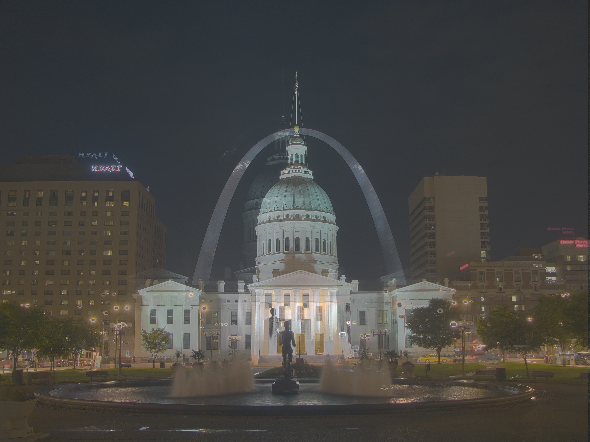
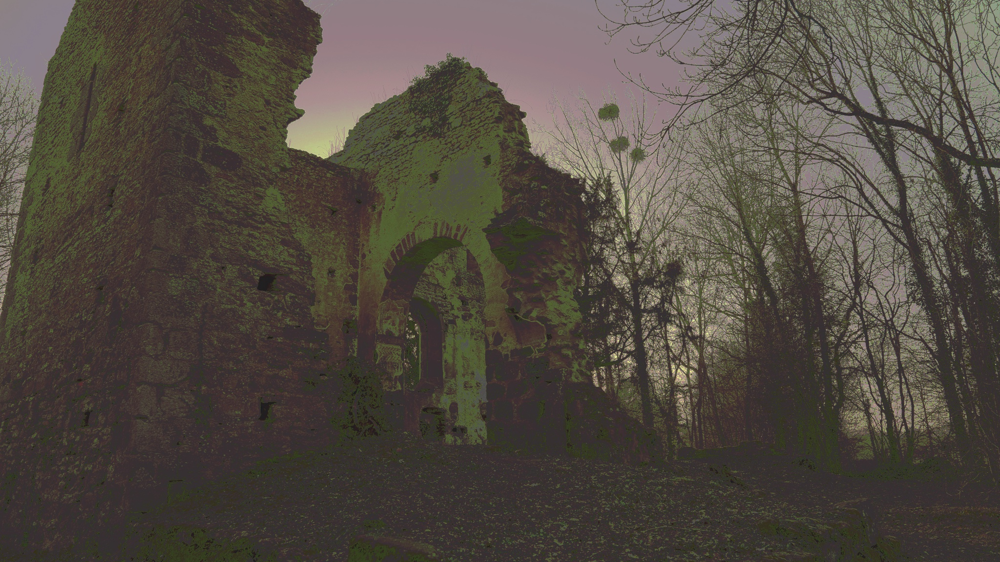
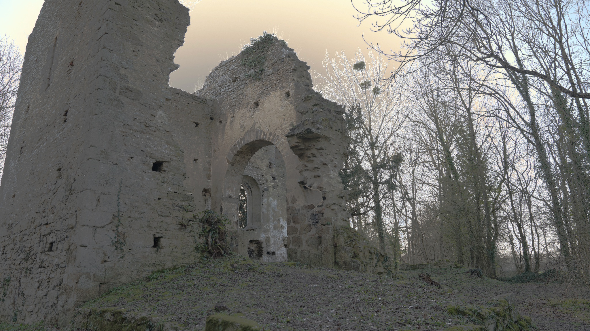
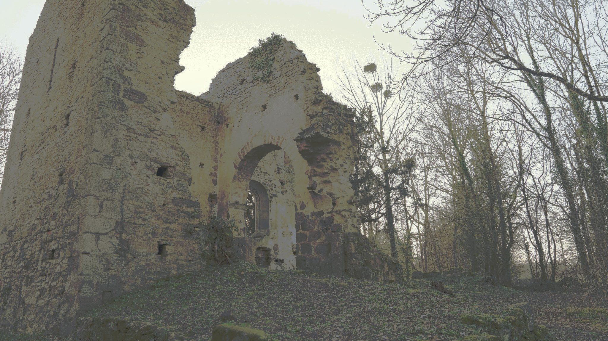
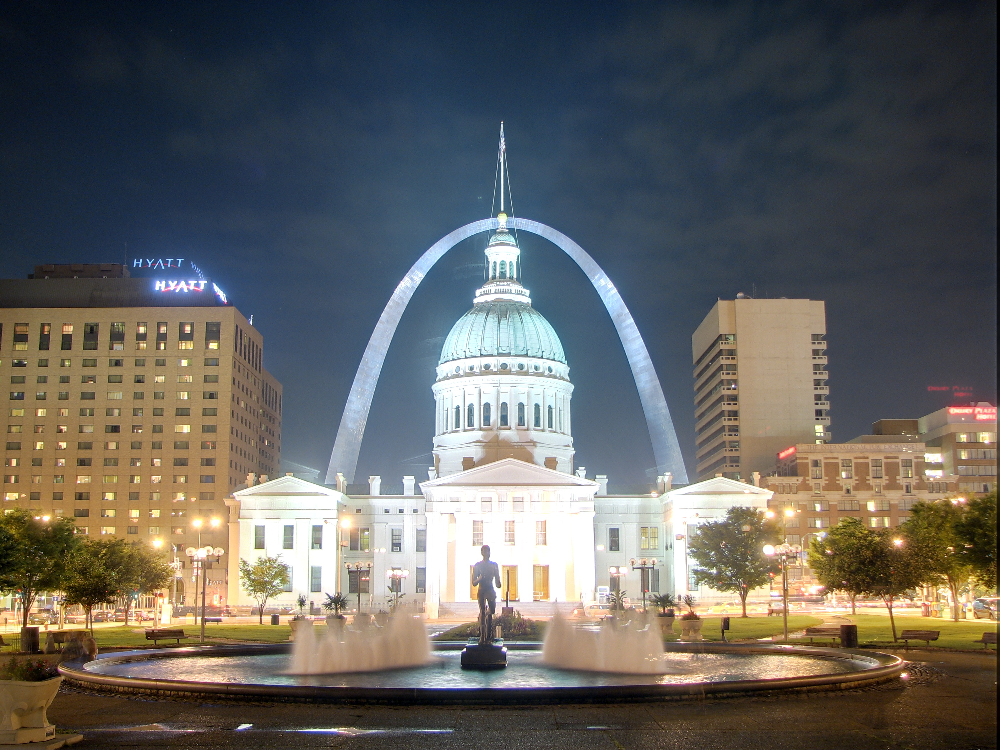
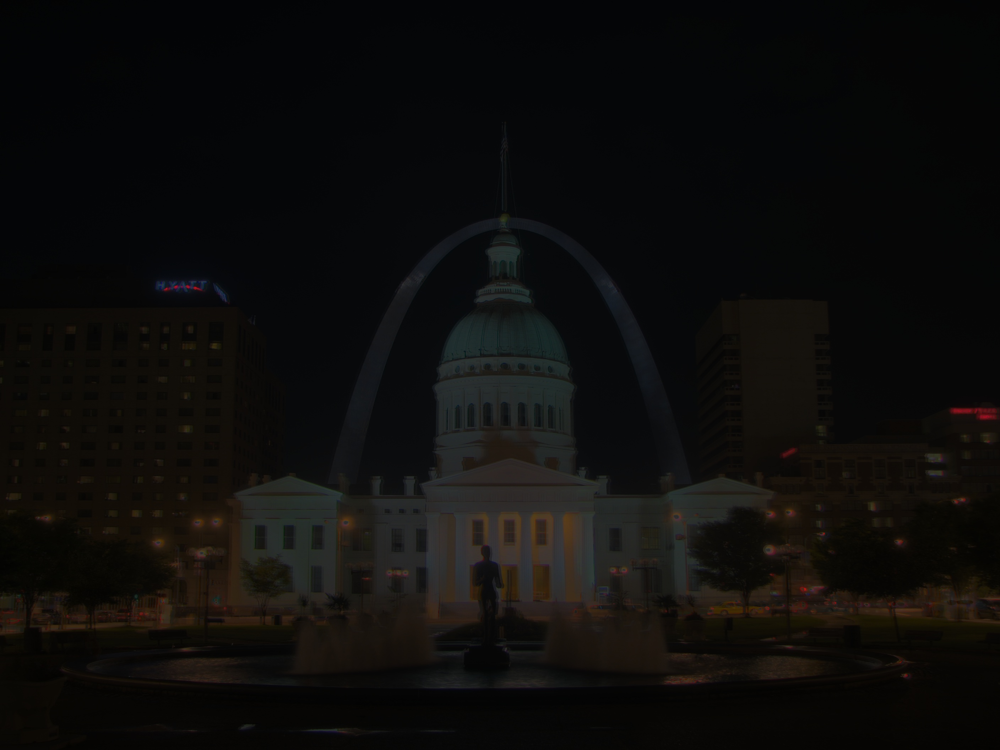
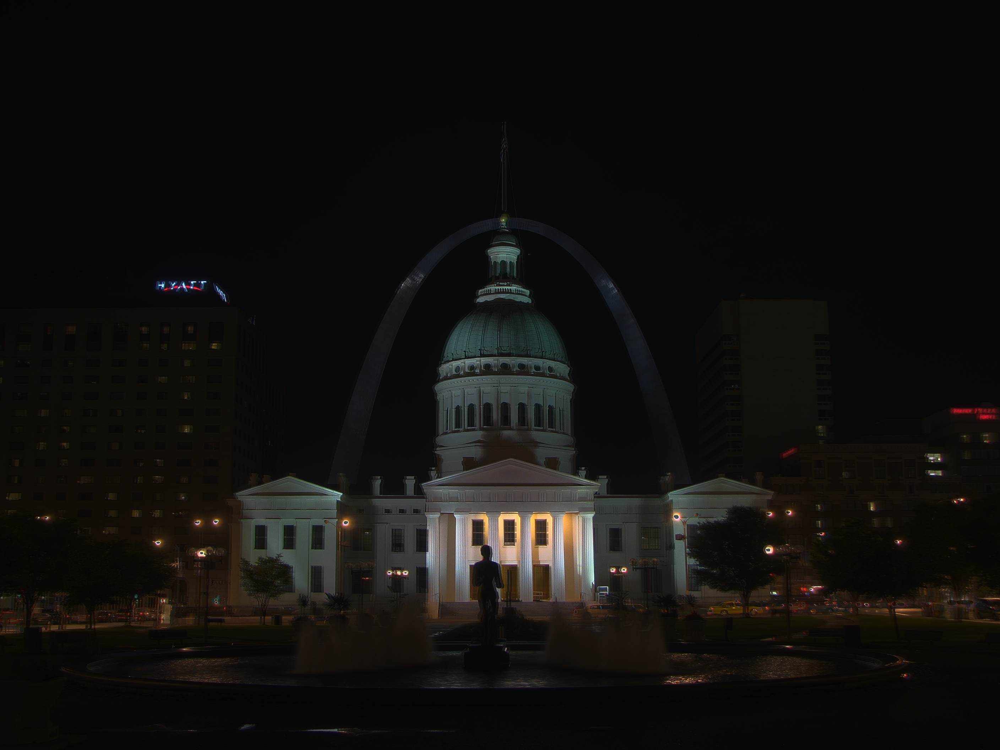
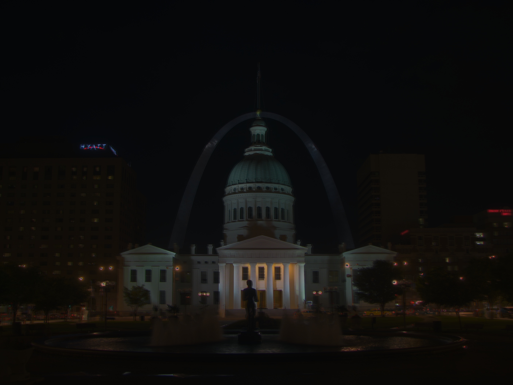
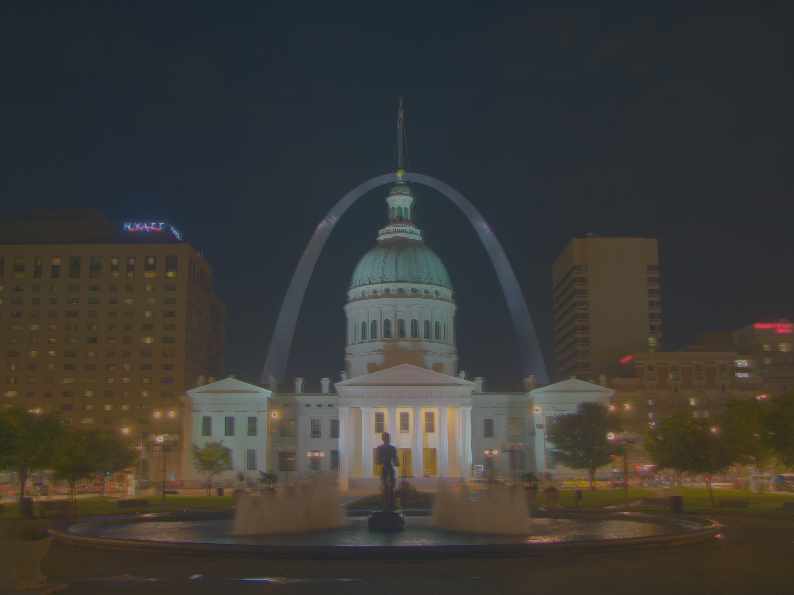

# HDR

*BERTHET Vincent*

*QUERO Benoit*

## Tutorial
[tutorial.py](./scripts/tutorial.py)
#### Debevec (Tonemap Durand)
Without Crf

Crf

#### Robertson (Tonemap Durand)
Without Crf

Crf

#### Mertens 

## Tone Mapping
[toneMapping.py](./scripts/toneMapping.py)
### cv2
#### Drago

#### Durand

#### Mantiuk

#### Reinhard

### HDRI @TODO
## Tone Mapping inverse