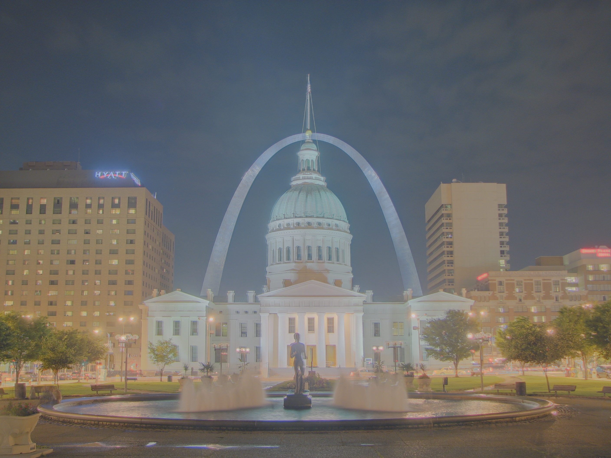
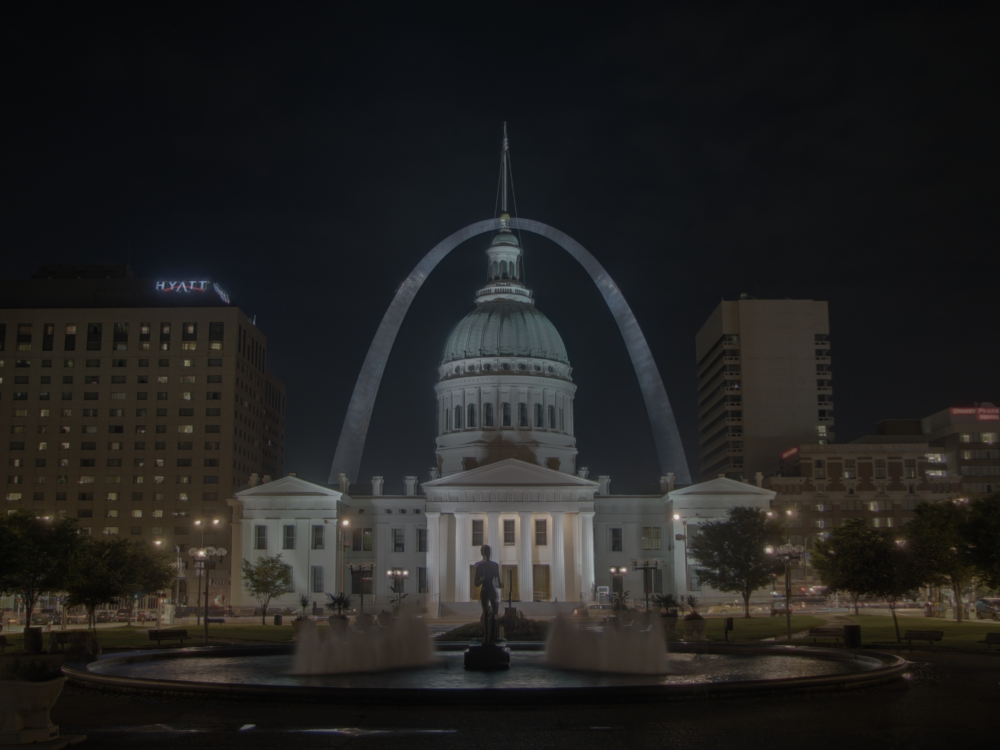
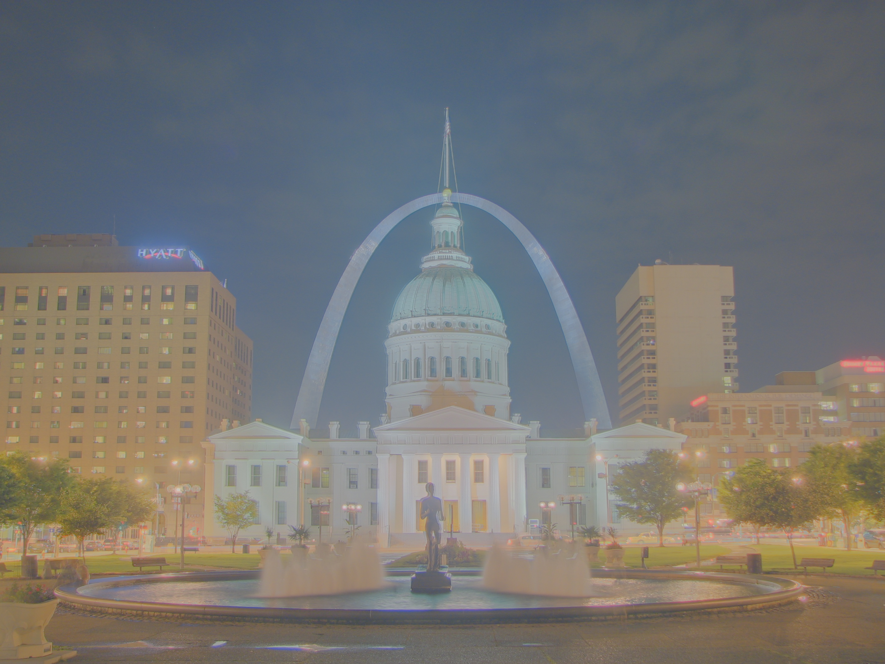
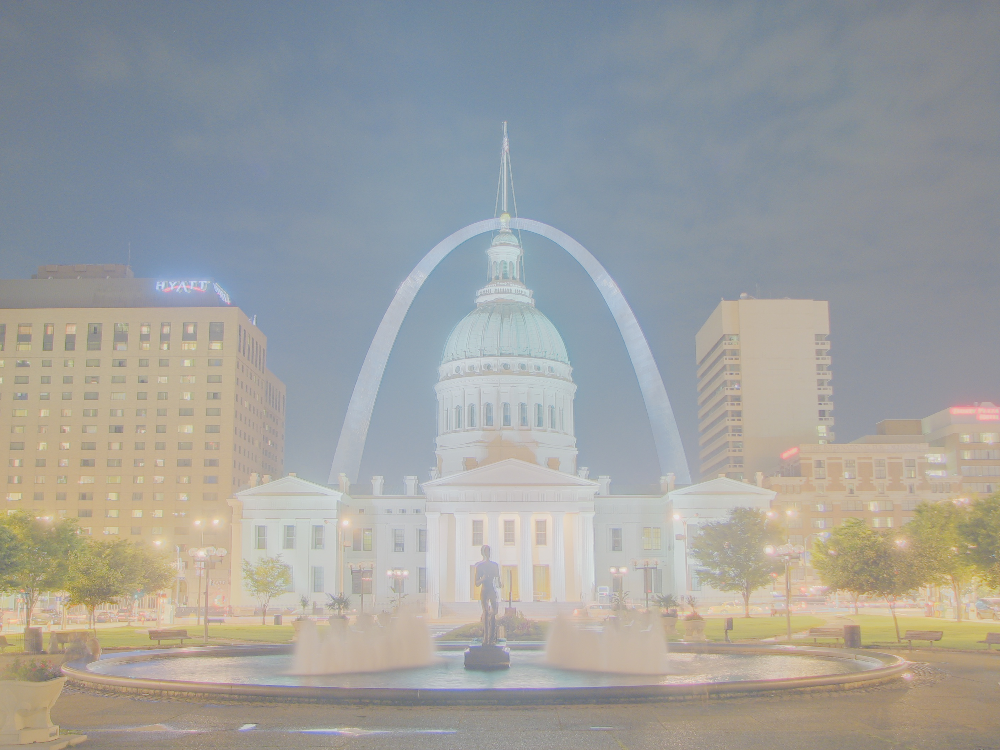

# HDR

*BERTHET Vincent*

*QUERO Benoit*

## Tutorial
[tutorial.py](scripts/tutorial.py)
#### Debevec (Tonemap Durand)
Luminance physique

#### Robertson (Tonemap Durand)
Luminance physique

#### Mertens 
Brigthness

## Tone Mapping
[toneMapping.py](scripts/toneMapping.py)
HDR image used is the mertens generated in previous tutorial
### cv2
#### Drago

#### Durand

#### Mantiuk

#### Reinhard

### HDRI @TODO
## Tone Mapping inverse