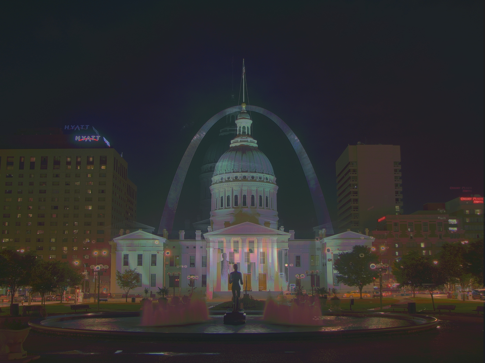
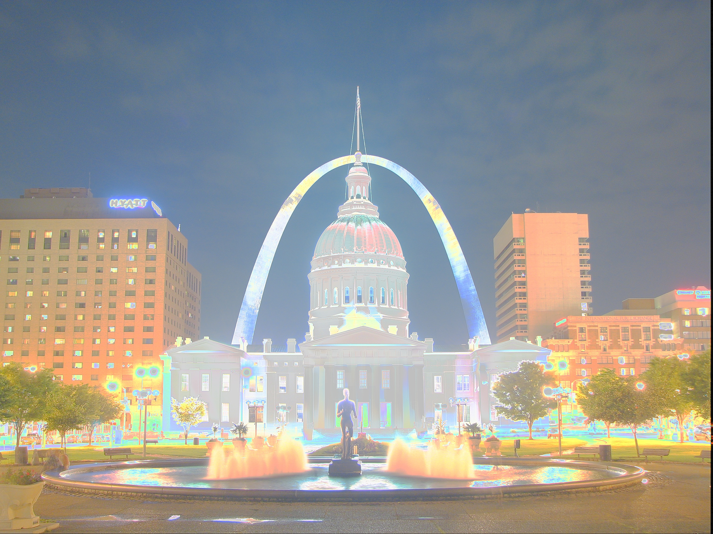
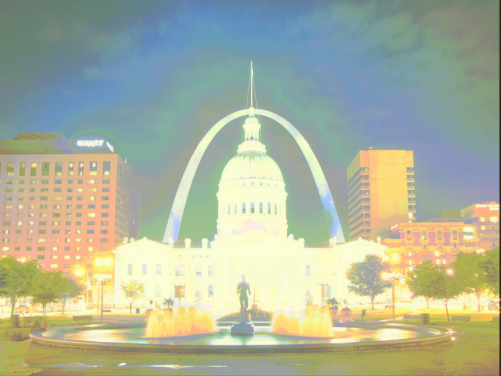

# HDR

By *BERTHET Vincent & QUERO Benoit*

*OpenCV v3.1.0 has been used, see [conda configuration file ](./conda/linux.yml)for dependencies*

The aim of this project was to exoeriment features related to High Dynamic Range (HDR)

## Tutorial
[tutorial.py](./scripts/tutorial.py)
#### Debevec (Tonemap Durand)

       | 
:-------------------------:|:-------------------------:
Without Crf| With Crf

#### Robertson (Tonemap Durand)
      | 
:-------------------------:|:-------------------------:

#### Mertens 

## Tone Mapping
[toneMapping.py](./scripts/toneMapping.py)
### cv2

Source :

|   |  |  |
|:-------------------------:|:-------------------------:|:-------------------------:|
| Exposure time = 1/800  | Exposure time = 1/125 | Exposure time = 1/4 |

#### Drago

#### Durand

#### Mantiuk

#### Reinhard

### HDRI Operators
#### Gamma Operator

#### Logarithmic Operator

#### Exponential Operator
